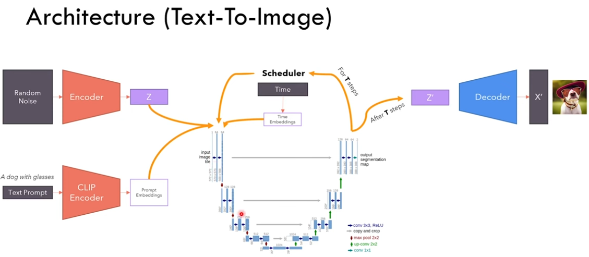
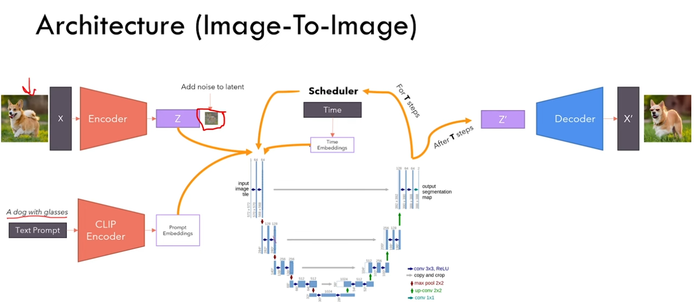
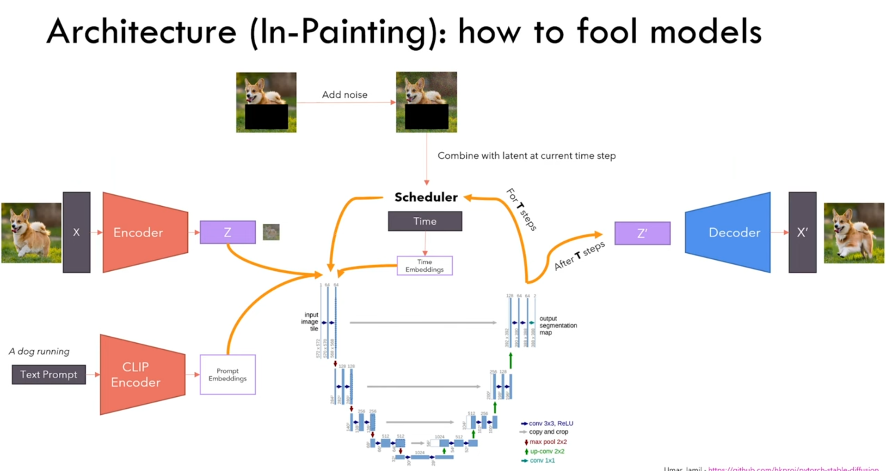
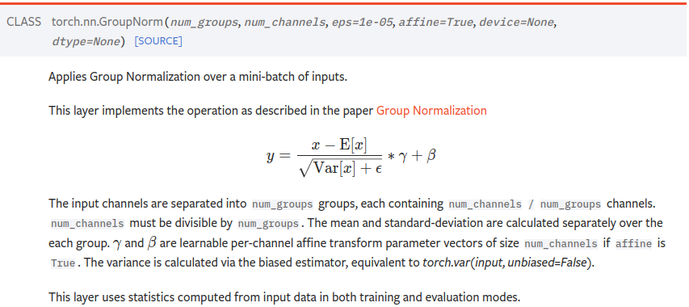

## Auto-encoder vs VAE:

```
The latent code learned from auto-encoder doesn't make any sense semantically. To solve this matter, we use VAE which embeds semantically similar images in closer neighbourhoods. 

VAE instead of learning a code,learns a latent space that represents the parameters of a multivariate distribution ( mean and variance of a Gaussian ).
```

<br>

##  Unet

```
1. We start with an image input (3 channels), then we gradually reduce the size of input image after each layer, at the same time increasing the number of features.
2. We use convolutions to reduce image size and increase feature size .
```

**NOTE: The dimensions of UNet shown in following figures doesn't correspond to the actual UNet dimensions used in case of diffusion models. **

<br>

## Stable Diffusion:Text-to-Image




```
1. Text prompt is given to CLIP encoder. eg: a dog with glasses

2. Sample some noise and encode it with VAE encoder, let output be Z. This is pure noise compressed by the encoder.

3. Prompt embeddings from the CLIP encoder, compressed noise Z, and initial time step T=1000 are given as input to the UNet. UNet has to determined how much noise to remove from Z such that it resembles the picture of the object mentioned in the prompt.

4.UNet will output the amount of noise to be removed Z'.The scheduler will remove the noise and again send it to UNet for second run. The input is passed to UNet along with a different time step (say, 980). This is continued for T steps, untill all noise is removed.

5. After T steps Z' is passed to the decoder to obtain output image.
```

*Here we are using latent vectors for noise removal rather adding noise to an image and inverting that directly, such models are called **Latent Diffusion Models**.*

<br>

## Stable Diffusion: Image-to-Image



<br>

```
1. Text prompt is given to CLIP encoder. eg: a dog with glasses

2. Pass input image to the encoder of VAE to get latent representation. Add noise to this latent representation. NOTE: we should add less noise here since we don't want a completly new image rather a modified version of the input image. In this way UNet is forced to make small modifications.

3.UNet will output the amount of noise to be removed Z'.The scheduler will remove the noise and again send it to UNet for second run. The input is passed to UNet, along with time step. This is continued for T steps, untill all noise is removed.

5. After T steps Z' is passed to the decoder to obtain output image.
```

1. *The job of UNet is denoising, hence we cannot pass an image directly to UNet. We must pass noisy images.*
2.  *The amount of noise determines the freedom of UNet, ie; if pure noise is passed the output is generated entirely out of hallucination as per the prompt input. However, lesser noise => constrained hallucination.*

<br>

## Stable Diffusion: In-painting



```
1. Text prompt is given to CLIP encoder. eg: a dog running

2. Pass input image to the encoder of VAE to get latent representation. Add noise to this latent representation. 

3.UNet will output the amount of noise to be removed Z'.

4.The scheduler will remove the noise and replace it with original image+some noise, except the portions which need to be in-painted. Then, this is passed to UNet. This is continued for T steps, untill all noise is removed.

5. After T steps Z' is passed to the decoder to obtain output image.
```

## GroupNorm

```

When we do convolution - in the output feature map - local features are more correlated
as compared to non-local features. GroupNorm takes advantage of this for normalization.
The normalization is performed similar to layer norm - along feature dimension - however not
all features are normalized - local features are grouped and normalized separately.
```


